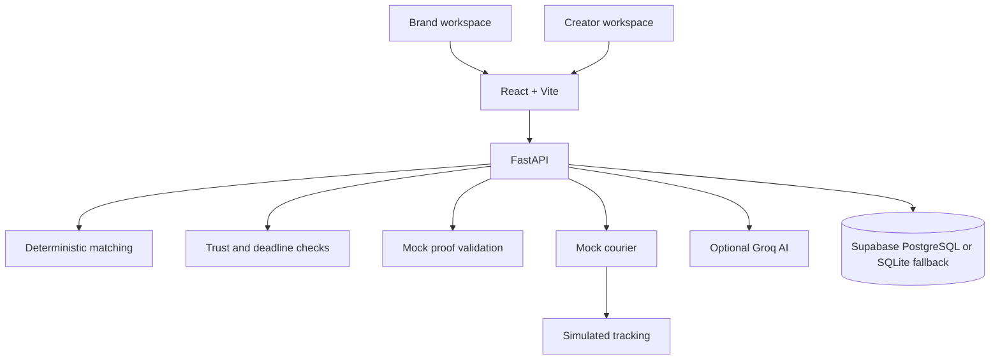

# BarterMatch

BarterMatch is a hackathon MVP for product gifting and creator collaborations: **Find → Match → Gift → Track → Post → Measure**. It includes brand and creator workspaces, deterministic explainable creator ranking, SQLite persistence, mock shipping and proof review, trust-score events, estimated UGC ROI, and optional backend-only Groq copy generation.

All bundled demo records are synthetic. Mock shipment tracking does not contact a courier; mock proof review does not scrape or verify a social account.

## Technology Stack

### Frontend

- **React** builds the brand and creator workspaces as reusable UI components.
- **TypeScript** provides typed application code.
- **Vite** runs the local development server and produces the production bundle.
- **Recharts** renders inventory and creator-trust analytics.
- **Lucide React** supplies the navigation icons.
- **CSS** provides the responsive layouts, dark visual theme, forms, and component styling. Tailwind CSS and shadcn/ui are not currently installed or used.
- **Browser localStorage** is only the offline fallback when the API cannot be reached.

### Backend

- **Python** runs the application services and API.
- **FastAPI** exposes the REST API and interactive OpenAPI documentation.
- **Pydantic** validates API request data.
- **Uvicorn** serves the FastAPI application.
- **python-dotenv** loads local configuration from `.env` files.
- **HTTPX** sends optional server-side requests to Groq.
- **Psycopg 3** connects to PostgreSQL-compatible databases.

### Data and Integrations

- **Supabase PostgreSQL** is supported when a Postgres connection URI is configured in `DATABASE_URL`.
- **SQLite** is the local default and automatic fallback when Supabase is not configured or unreachable.
- **Groq API** optionally generates campaign copy, match explanations, outreach, insights, and risk summaries. Without credentials, deterministic fallback text is used. Numeric creator matching remains deterministic.
- **Mock courier and proof verification** simulate shipping stages and proof review; they do not contact real courier or social-media services.
- **JSON sample data** seeds synthetic creators and products locally without requiring Kaggle during a demo.
- **pytest and HTTPX** are used for backend API and service tests.

### Build and Run Tools

- Frontend commands: `npm run dev`, `npm run build`
- Backend command: `uvicorn app.main:app --reload`
- Database schemas: `backend/app/database/schema.sql` for SQLite and `schema_postgres.sql` for Postgres.



## Run locally on Windows

Start the API:

```powershell
cd C:\Users\Dell\Desktop\bartermatch\backend
py -3.13 -m venv .venv
.\.venv\Scripts\Activate.ps1
python -m pip install -r requirements.txt
uvicorn app.main:app --reload --port 8000
```

Start the web client in a second terminal:

```powershell
cd C:\Users\Dell\Desktop\bartermatch\frontend
npm install
npm run dev
```

Open the Vite URL (normally `http://localhost:5173`). API documentation is at `http://127.0.0.1:8000/docs`; health is `http://127.0.0.1:8000/api/health`.

## Environment

Copy `.env.example` to `backend/.env` (or project-root `.env`). Defaults run with SQLite, mock shipping, mock social validation, and deterministic AI fallback. Set `GROQ_API_KEY` to enable Groq; `GROQ_MODEL` selects the model. The key is read only by the backend and must never be placed in a `VITE_` variable.

`DATABASE_URL=sqlite:///./bartermatch.db` selects the persistent SQLite file under `backend/`. To switch to Supabase, create a cloud project, open **Connect**, select the **Session Pooler** connection URI, and set that full URI as `DATABASE_URL` in `backend/.env`. The backend schema and seed the hosted Postgres database at startup. No Supabase desktop installation is needed. Use the database password inside the connection URI, not the Supabase anon/publishable key. URL-encode special characters in the password. If the Postgres URL is absent or unreachable, the API warns and continues with local SQLite. `SQLITE_PATH` can override that fallback path. The browser uses `localStorage` only if FastAPI itself cannot be reached.

Keep `.env` local and never paste the database URI or password into chat or commit it. `/api/health` reports whether the active store is `postgres` or `sqlite`.

## Demo accounts and flow

- Brand: `brand@example.com`
- Creator: `asha@example.com` (choose Creator in the role selector)
- Demo sign-in has no password and is not production authentication.

Suggested 5-minute walkthrough:

1. On Overview, run **Run live demo** to record a complete synthetic match, claim, delivery, proof, and trust update.
2. Create a campaign with product, audience thresholds, deliverable, platform, and deadline.
3. Open AI Matching, select the campaign, inspect the deterministic score, and invite a creator.
4. Switch to the creator workspace, accept the invitation or claim an available campaign, then submit a matching public-format URL.
5. Use Logistics to dispatch and advance a mock shipment; delivery creates the posting deadline.
6. In the brand-only **Proof Review** page, review the pending submission and approve it. The creator then sees the brand-attributed verified badge. This is BarterMatch mock review, not Instagram verification.
7. Return to Overview to see stored inventory, campaign, shipment, trust, and estimated UGC metrics refresh.

All money/ROI figures are estimates for demonstration, not audited revenue. The sample creator identities and posts are synthetic.

## API highlights

- `POST /api/auth/demo-login`
- `GET|POST /api/products`, `GET /api/creators`, `GET|POST /api/campaigns`
- `GET /api/matching/{campaign_id}`, `POST /api/matching`
- `POST /api/campaigns/{id}/invite`, `POST /api/campaigns/{id}/claim`
- `GET /api/collaborations`, `POST /api/collaborations/{id}/claim`, `POST /api/collaborations/{id}/ship`
- `GET /api/shipments`, `POST /api/shipments/{collaboration_id}`, `POST /api/shipments/{id}/advance`
- `POST /api/collaborations/{id}/proof`, `POST /api/proofs/{id}/verify`
- `GET /api/dashboard/brand`, `GET /api/dashboard/creator`, `GET /api/analytics`
- `POST /api/ai/campaign-description`, `/api/ai/match-explanation`, `/api/ai/outreach`, `/api/ai/insights`, `/api/ai/risk-explanation`
- `POST /api/live-demo`

## Dataset and tests

`data/raw` and `data/processed` include local sample data; the bundled records are synthetic and do not require Kaggle access. `scripts/import_dataset.py` loads processed creator/product JSON into the configured database. API startup seeds at least five demo brands, 50 creator profiles with varied synthetic display names, 20 products, 25 curated campaign examples, and 30 collaboration lifecycle records idempotently.

Install test dependencies with `python -m pip install pytest httpx`, then run from the project root:

```powershell
py -3.13 -m pytest -q
```

## Current limitations

- Supabase must be configured with the Postgres connection URI in `DATABASE_URL`; `SUPABASE_URL` and `SUPABASE_ANON_KEY` alone are not database credentials.
- Authentication is a demo identity gate, not authorization. Do not expose this app as a production service without adding real sessions, access controls, rate limiting, secrets management, and privacy review.
- Basic rate limiting is not implemented in this prototype.
- Shiprocket/Delhivery classes are placeholders. Only mock shipping is enabled.
- Proof checks validate URL format, platform host, duplicate submissions, and timestamps. Mock verification is not social-platform verification.
- AI copy uses Groq when configured; matching numeric scores always come from deterministic backend logic.